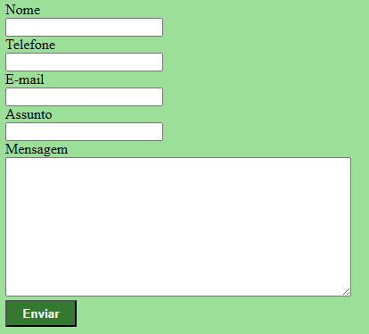

# Projeto- Formulário de Contato

O projeto foi criado como parte avaliativa da disciplina de Fundamentos de Desenvolvimento Web, ministrada pelo professor Leonardo Rocha.

## Índice

* [Descrição](#descrição)
* [Tecnologias](#tecnologias)
* [Referências](#referência)
* [Autor(a)](#autora)

### Descrição 

O projeto se consiste, basicamente, em uma tela de formulário de contato, como diz o nome.

### Resultado do Formulário de Contato- Completo

### Estilização

O projeto foi estilizado usando o CSS3. Foi criando um arquivo chamado login.css. Nesse arquivo, constam conconfigurações de estilo apresentadas a seguir:

* Height - O height é resposável por determinar a altura da área do conteudo do elemento.
* Background-color - O background-color é responsável por definir a cor de fundo.
* Width - O width é responsável por determinar a largura de um elemento.
* Color - O color é responsável por definir a cor de um determinado texto.

### Elementos do HTML

* Main -
* Form -
* Label -
* Input -
* Br -
* Textarea -
* Button -

## Tecnologias

* HTML5 
* CSS3
* README
* Git
* Github

## Referência

[Developer/HEIGHT](https://developer.mozilla.org/en-US/docs/Web/CSS/height)

[Developer/BACKGROUND-COLOR](https://developer.mozilla.org/en-US/docs/Web/CSS/background-color)

[Developer/WIDHT](https://developer.mozilla.org/en-US/docs/Web/CSS/width)

[Developer/COLOR](https://developer.mozilla.org/en-US/docs/Web/CSS/color)

## Autor(a)

O projeto foi desenvolvido pela estudante Maria Luíza Farias da Silva.